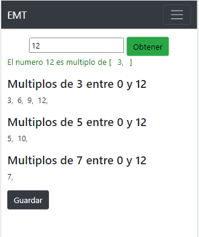
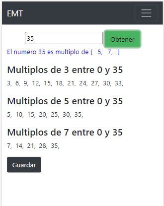
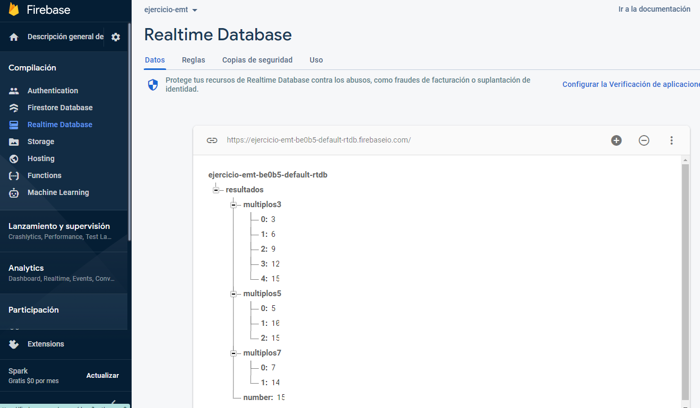

# ejercicio-emt

This project was generated with [ngX-Rocket](https://github.com/ngx-rocket/generator-ngx-rocket/)
version 10.1.2

# Getting started

1. Go to project folder and install dependencies:
 ```sh
 npm install
 ```

2. Launch development server, and open `localhost:4200` in your browser:
 ```sh
 npm start
 ```

# Project structure

```
dist/                        web app production build
docs/                        project docs and coding guides
src/                         project source code
|- app/                      app components
|  |- core/                  core module (singleton services and single-use components)
|  |- shared/                shared module  (common components, directives and pipes)
|  |- app.component.*        app root component (shell)
|  |- app.module.ts          app root module definition
|  |- app-routing.module.ts  app routes
|  +- ...                    additional modules and components
|- assets/                   app assets (images, fonts, sounds...)
|- environments/             values for various build environments
|- theme/                    app global scss variables and theme
|- translations/             translations files
|- index.html                html entry point
|- main.scss                 global style entry point
|- main.ts                   app entry point
|- polyfills.ts              polyfills needed by Angular
+- test.ts                   unit tests entry point
reports/                     test and coverage reports
proxy.conf.js                backend proxy configuration
```

# Proyecto que Encuentra los múltiplos del 3, 5 y 7 que existan entre el 0 y el número que ingresó el usuario
  
 


# Guardar la petición y el resultado en la base de datos
